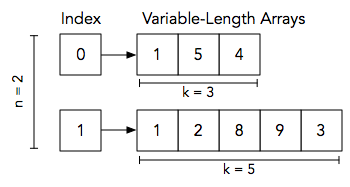

**Variable Sized Arrays**
by ikbalkazar

**Problem**

Consider a `n`-element array, a, where each index `i` in the array contains a reference to an array of `k` integers (where the value of  `ki` varies from array to array). See the Explanation section below for a diagram.

Given `a`, you must answer `q` queries. Each query is in the format `i j`, where `i` denotes an index in array  and `j` denotes an index in the array located at `a[i]`. For each query, find and print the value of  element `j` in the array at location `a[i]` on a new line.

**Input Format**

The first line contains two space-separated integers denoting the respective values of `n` (the number of variable-length arrays) and `q` (the number of queries).
Each line `i` of the `n` subsequent lines contains a space-separated sequence in the format `k a[i]0 a[i]1 … a[i]k-1` describing the `k`-element array located at `a[i]` .
Each of the `q` subsequent lines contains two space-separated integers describing the respective values of `i` (an index in array `a`) and `j` (an index in the array referenced by `a[i]`) for a query.

**Constraints**

All indices in this challenge are zero-based.
Output Format

For each pair of `i` and `j` values (i.e., for each query), print a single integer denoting the element located at index `j` of the array referenced by `a[i]`. There should be a total of `q` lines of output.

**Sample Input**
```
2 2
3 1 5 4
5 1 2 8 9 3
0 1
1 3
```

**Sample Output**
```
5
9
```

Explanation

The diagram below depicts our assembled Sample Input:


```cpp
int main(){
    int n, q;
    cin >> n >> q;
    int qa[q], qe[q];
    int arrsize;
    int arr[100000][300000];
    for(int i=0;i<n;i++){
        cin >> arrsize;
        for(int j = 0;j<arrsize;j++){
            cin >> arr[i][j];
        }
        cout << arr[i] << endl;
    }
    for(int i=0;i<q;i++){
        cin >>  qa[i] >> qe[i];
    }
    for(int i=0;i<q;i++){
        cout << arr[qa[i]][qe[i]] << endl;
    }
    return 0;
  }
  ```
​
